# Crawl_cc 架构图版项目说明

## 1. 文档目的

本文档是 `Crawl_cc` 的“架构图版”说明，面向以下场景：

- 快速理解项目整体结构
- 做方案汇报或演示
- 作为阅读源码前的导航图
- 辅助技术评审和项目交接

如果你需要更完整的文字版说明，请结合仓库根目录下的 `项目说明文档.md` 一起阅读。

## 2. 项目一句话概括

`Crawl_cc` 是一个围绕懂车帝汽车车系数据构建的工程化 RAG 项目，覆盖“采集 -> 清洗 -> 治理 -> 分流 -> 建索引 -> 问答 -> 评测 -> 回流 -> 工作流编排 -> 多轮对话服务”完整链路。

## 3. 总体架构图

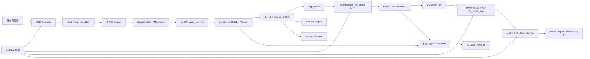

## 4. 分层架构图

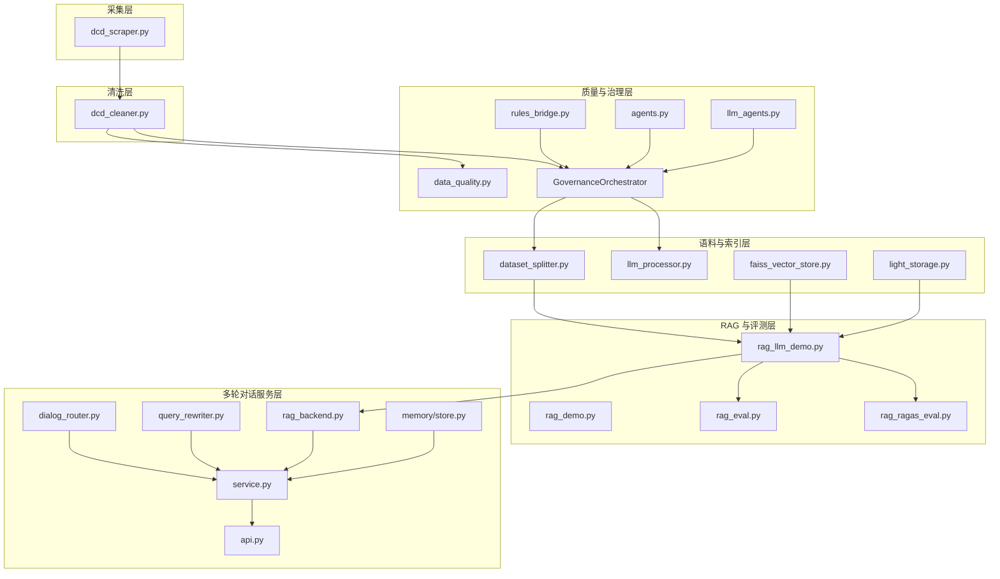

## 5. 数据流架构图

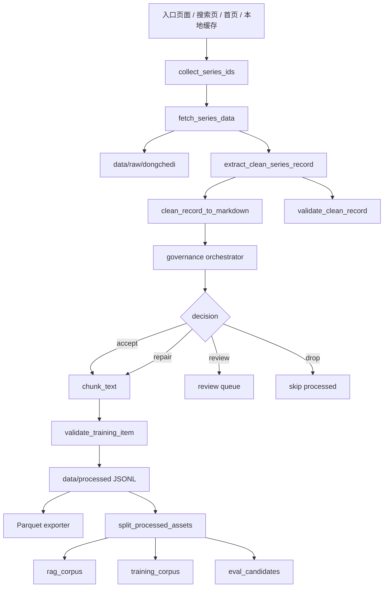

## 6. 治理链路图

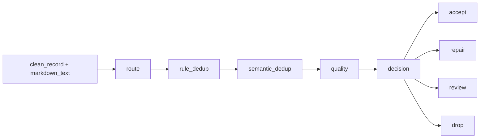

### 6.1 节点职责

| 节点 | 主要职责 | 是否可用 LLM |
| --- | --- | --- |
| `route` | 识别样本渠道、模板、处理策略 | 是 |
| `rule_dedup` | 基于内容 hash / 规范化 hash 去重 | 否 |
| `semantic_dedup` | 基于相似度阈值做语义去重 | 否 |
| `quality` | 输出质量分、问题标签、修复建议、readiness | 是 |
| `decision` | 给出 `accept / repair / review / drop` | 否 |

### 6.2 治理结果落盘图

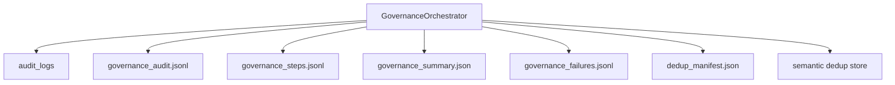

## 7. RAG 架构图

### 7.1 构建阶段

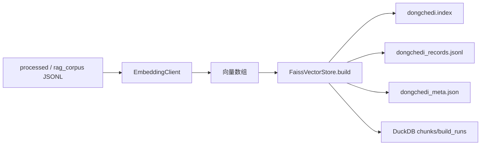

### 7.2 查询阶段

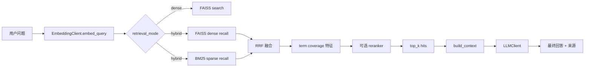

### 7.3 RAG 组件关系图

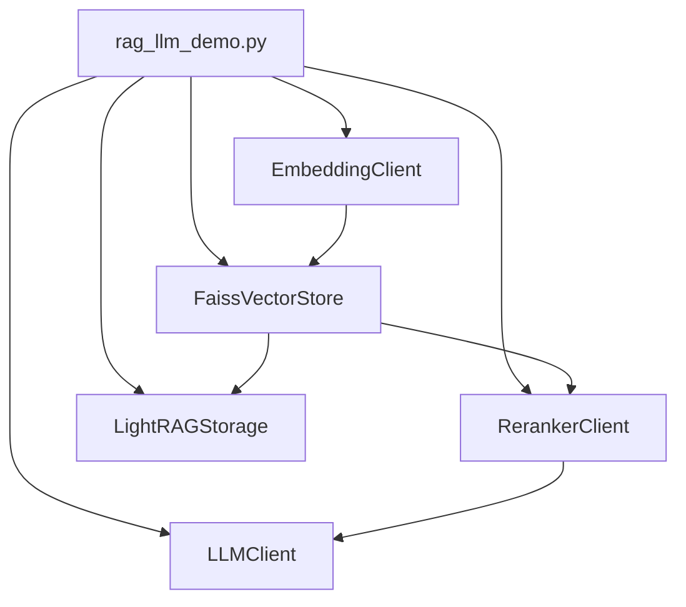

## 8. 评测与回流架构图

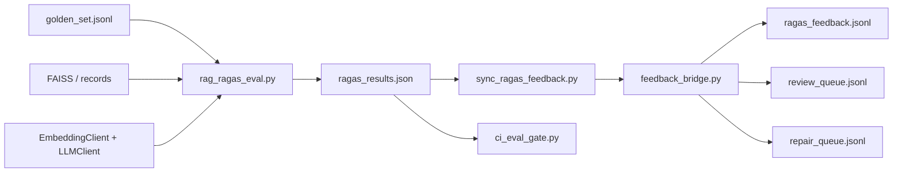

### 8.1 评测模式

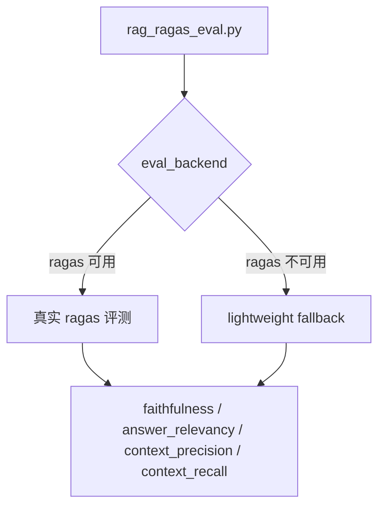

## 9. 多轮对话架构图

### 9.1 对话主流程

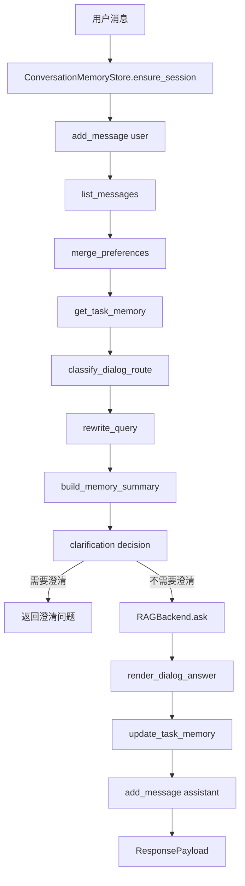

### 9.2 记忆结构图

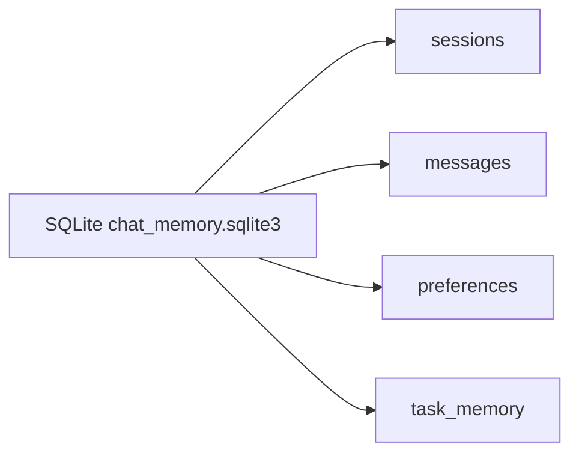

### 9.3 API 架构图

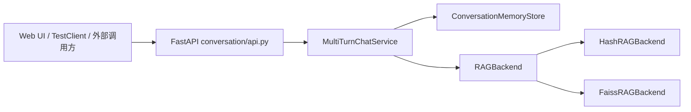

## 10. 工作流架构图

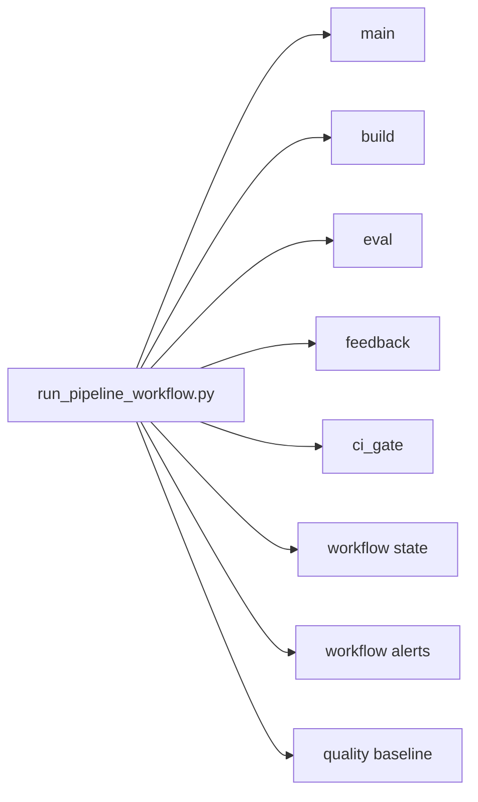

### 10.1 状态文件内容

| 内容 | 说明 |
| --- | --- |
| `run_id` | 本次工作流 ID |
| `steps` | 每一步命令、耗时、返回码、输出摘要 |
| `resume_history` | 断点续跑历史 |
| `alerts` | 失败告警与质量漂移告警 |
| `results.success` | 本次工作流是否成功 |
| `results.failed_step` | 失败步骤名称 |

## 11. 模块职责速查表

| 模块 | 代表文件 | 核心职责 |
| --- | --- | --- |
| 抓取层 | `scraper/dcd_scraper.py` | 多入口收集车系 ID、抓取页面、保存 raw 数据 |
| 清洗层 | `cleaner/dcd_cleaner.py` | 规范化原始 JSON、生成 Markdown |
| 质量层 | `quality/data_quality.py` | 规则质检、质量报告、字段覆盖统计 |
| 治理层 | `agent_pipeline/orchestrator.py` | 编排 route/dedup/quality/decision |
| 资产分流 | `agent_pipeline/dataset_splitter.py` | 输出 `rag_corpus/training_corpus/eval_candidates` |
| RAG 层 | `rag_llm_demo.py` | build/query、混合检索、生成问答 |
| 评测层 | `rag_ragas_eval.py` | ragas 与 fallback 评测 |
| 回流层 | `agent_pipeline/feedback_bridge.py` | 低分样本分类回流 |
| 工作流层 | `scripts/run_pipeline_workflow.py` | 串联主流程并落状态与告警 |
| 对话层 | `conversation/service.py` | 多轮状态管理与统一对话入口 |
| 记忆层 | `memory/store.py` | SQLite 持久化 session/messages/preferences/task_memory |

## 12. 典型运行路径图

### 12.1 离线数据生产与 RAG 构建

```text
python main.py
-> python scripts/split_processed_assets.py
-> python rag_llm_demo.py build ...
-> python rag_ragas_eval.py ...
-> python scripts/sync_ragas_feedback.py ...
-> python scripts/ci_eval_gate.py ...
```

### 12.2 多轮服务启动

```text
python scripts/serve_multi_turn_api.py --backend-mode hash --host 127.0.0.1 --port 8001
-> FastAPI
-> /ui 前端页面
-> /docs Swagger
-> /api/v1/chat 多轮对话
```

## 13. 适合如何理解这个项目

可以从三个视角理解：

### 13.1 从数据工程视角

它是一个“原始网页 -> 高质量语料 -> 多类资产”的数据流水线。

### 13.2 从 RAG 视角

它是一个“语料治理 + 混合检索 + 评测回流”的 RAG 工程原型。

### 13.3 从应用视角

它是一个“带会话记忆与 query rewrite 的汽车问答/推荐服务”。

## 14. 结论

`Crawl_cc` 的价值不只在于代码功能数量，而在于它已经具备较完整的工程链路：

- 有真实数据入口
- 有清洗和治理
- 有索引和问答
- 有评测和回流
- 有工作流和验收
- 有多轮服务和前端

如果作为项目汇报材料，推荐优先展示本文档中的总览图、治理链路图、RAG 架构图和多轮对话流程图。

---

**文档版本**: v1.0  
**最后更新**: 2026-05-28
